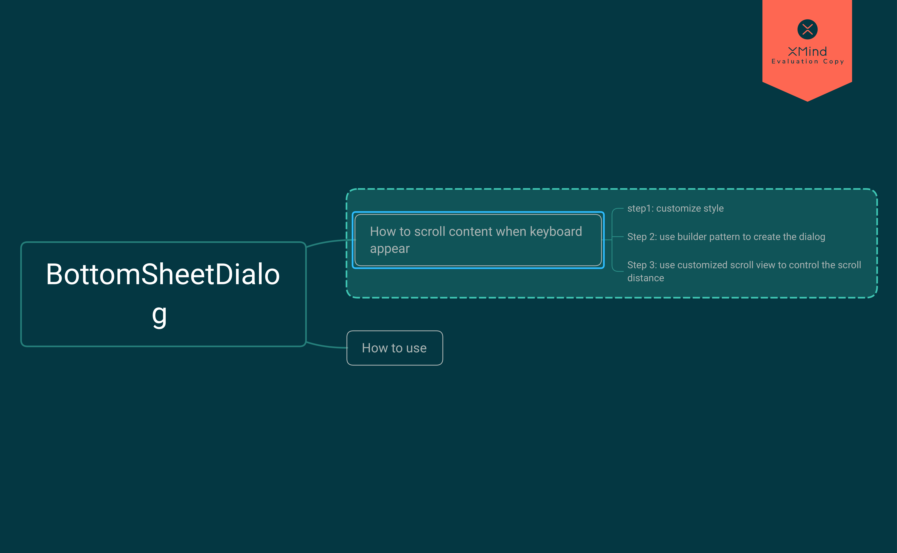

# handle some issue when use BottomSheetDialog as login



## What happened when I am using ?

When I tried to use the BottomSheetDialog to realize the effect that a login UI slide from bottom up to the screen when user is not logged in. Yeah, it's cool. But when I tapped the EditText, a horrible thing appeared. Why the confirm button is behind the keyboard???

### find a solution

Here is the solution I found. It contains three steps.
Let's have a try!

#### Step 1 - customize style

```
<style name="BottomSheetEdit" parent="Theme.Design.Light.BottomSheetDialog">
        <item name="android:windowIsFloating">false</item>
        <item name="android:windowSoftInputMode">adjustResize</item>
</style>
```

let's set the false to the item "android:windowIsFloating", if set true, we can not control the scroll position, I don't know why yet.

we set adjustResize to the item "android:windowSoftInputMode" to make sure the method `onGlobalLayout()` will be invoked when keyboard appears.

#### Step 2 - use builder pattern to create the dialog


#### Step 3 - use customized scroll view to control the scroll distance

Actually, I spent lots of time on this part. Cause we used the customized `RelativeLayout` as the root layout in the login view of the activity to make the layout scrollable(Why? remember the keyboard will make the confirm button unseen).

It worked perfect until we update the gradle and AS.(Still don't know why the root view's height become shorter when tapped the EditText, keyboard shows, dialog scroll up). 

So I changed the root layout to `ScrollView`. Now let's see what I have done with it.

```
import android.content.Context;
import android.graphics.Rect;
import android.util.AttributeSet;
import android.view.View;
import android.view.ViewGroup;
import android.view.ViewTreeObserver;
import android.widget.EditText;
import android.widget.ScrollView;

import java.util.ArrayList;
import java.util.List;

public class ContainEditTextScrollView extends ScrollView {

    private View mAnchor;
    private static final String TAG = "ContainEditTextScrollView";
    private List<EditText> mChildEtList = new ArrayList<>();
    private boolean isFirst = true;
    private EditText focusET;

    public ContainEditTextScrollView(Context context) {
        super(context);
        init();
    }

    public ContainEditTextScrollView(Context context, AttributeSet attrs) {
        super(context, attrs);
        init();
    }

    public ContainEditTextScrollView(Context context, AttributeSet attrs, int defStyleAttr) {
        super(context, attrs, defStyleAttr);
        init();
    }

    public void setAnchor(View anchor) {
        this.mAnchor = anchor;
    }

    private void init() {
        getViewTreeObserver().addOnGlobalLayoutListener(new ViewTreeObserver.OnGlobalLayoutListener() {
            @Override
            public void onGlobalLayout() {

                if (mAnchor == null) return;
                if (isFirst) {
                    isFirst = false;
                    //遍历并保存所有editText并设置焦点改变监听
                    collectChild(ContainEditTextScrollView.this);
                }
                Rect rect = new Rect();
                getWindowVisibleDisplayFrame(rect);
                int mainInvisibleHeight = getRootView().getHeight() - rect.bottom;
                if (mainInvisibleHeight > 0) {
                    int[] location = new int[2];
                    mAnchor.getLocationInWindow(location);
                    //计算系统由于键盘遮挡editText导致布局移动的距离
                    int anchorBottom = location[1] + mAnchor.getHeight();
                    int scrollHeight = anchorBottom - rect.bottom;//- rect.bottom - delta;
                    smoothScrollBy(0 , scrollHeight);
                } else {
                    smoothScrollTo(0 , 0);
                }
            }
        });
    }


    private void collectChild(ViewGroup parent) {
        int count = parent.getChildCount();
        for (int i = 0; i < count; i++) {
            View view = parent.getChildAt(i);
            if (view instanceof ViewGroup) {
                collectChild((ViewGroup) view);
            } else if (view instanceof EditText) {
                EditText et = (EditText) view;
                et.setOnFocusChangeListener(listener);
                mChildEtList.add(et);
            }
        }
    }


    private OnFocusChangeListener listener = new OnFocusChangeListener() {
        @Override
        public void onFocusChange(View v, boolean hasFocus) {
            if (hasFocus && v instanceof EditText)
                focusET = (EditText) v;
        }
    };

    private int getFocusViewY() {

        if (focusET != null) {
            int[] location = new int[2];
            focusET.getLocationInWindow(location);
            return location[1] + focusET.getHeight();
        }
        return 0;
    }

    @Override
    public void computeScroll() {
        super.computeScroll();
    }
}

``` 

In our customized scroll view, we use `mAnchor` to hold the which is above the keyboard.

In all construction method, we invoke the `init()` method which we can add observer to calculate the scroll distance.

Cause we set the dialog style, so currently when we tapped the EditText, the dialog will stick on top of the window.

It's pretty good, but we can do better. Now we calculate the distance of bottom position of the `mAnchor` and bottom of the visible area of dialog. The distance is what we need `ScrollView` to scroll.

That's it. Back to Dialog. Let's see what's in it:

```

private void init(Context context) {

    getWindow().setSoftInputMode(WindowManager.LayoutParams.SOFT_INPUT_ADJUST_RESIZE | WindowManager.LayoutParams.SOFT_INPUT_STATE_HIDDEN);

    ...

    try {
        // hack bg color of the BottomSheetDialog
        View parent = (View) view.getParent();
        BottomSheetBehavior behavior = BottomSheetBehavior.from(parent);
        view.measure(0, 0);
        behavior.setPeekHeight(view.getMeasuredHeight());

        CoordinatorLayout.LayoutParams params = (CoordinatorLayout.LayoutParams) parent.getLayoutParams();
        params.gravity = Gravity.TOP | Gravity.CENTER_HORIZONTAL;
        parent.setLayoutParams(params);
        parent.setBackgroundResource(android.R.color.transparent);
        
    } catch (Exception e) {
        e.printStackTrace();
    }

    ...
    
}

```

we set the dialog height through `BottomSheetBehavior` and set background to transparent.

Finally, don't forget to set the `anchor`.